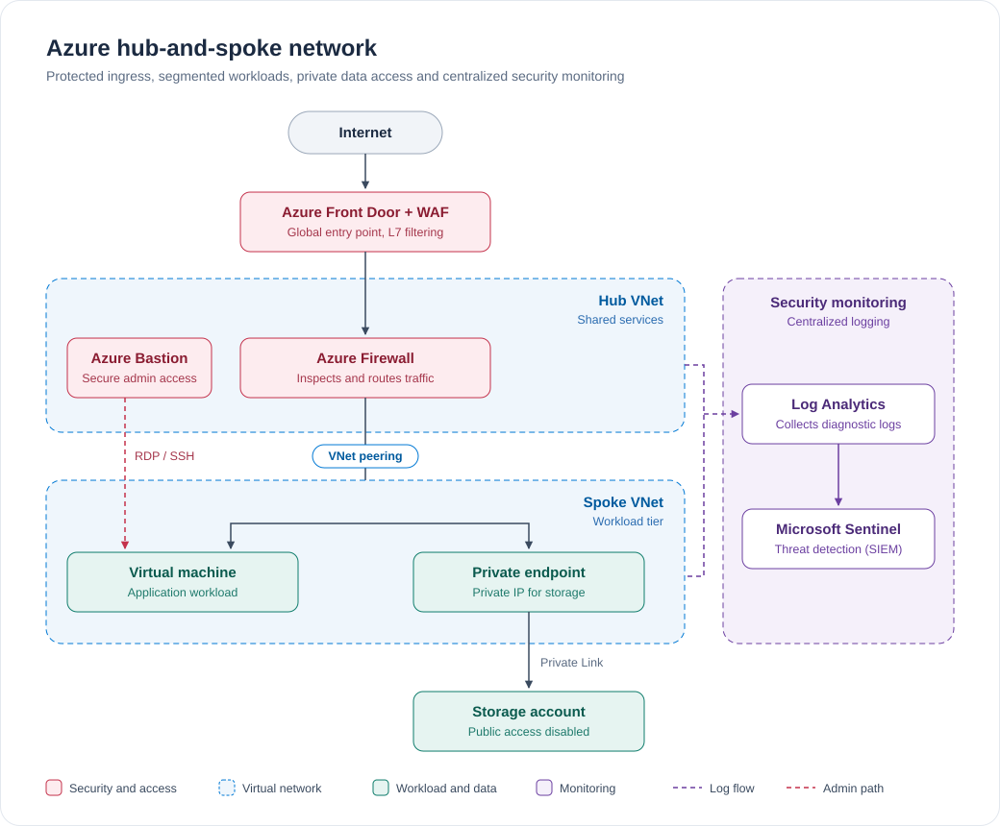

# Azure Secure Enterprise Zone
End-to-end Azure cloud platform showcasing hub-and-spoke networking, Entra ID, Defender for Cloud, Sentinel, Terraform, GitHub Actions, and enterprise security architecture.

## Overview

Azure Secure Enterprise Zone is a hands-on cloud engineering and security project designed to simulate a real-world enterprise Azure environment.

The goal of this project is to demonstrate practical skills across multiple Azure disciplines, including `networking`, `identity`, `security`, `governance`, `monitoring`, `infrastructure as code`, and `DevOps automation`.

This repository serves as both a technical portfolio project and a reference architecture for Azure administration, cloud engineering, and security engineering roles.

---

## Architecture Goals

The platform is designed around the following principles:

- Zero Trust security model
- Least-privilege access
- Infrastructure as Code
- Secure remote administration
- Private service communication
- Centralized monitoring and logging
- Automated deployments
- Enterprise-grade networking

---

## Resource Group Structure

| Resource Group | Purpose |
|---|---|
| `rg-hub-prod` | Central networking and connectivity resources |
| `rg-spoke-prod` | Application, compute, and workload resources |
| `rg-security-prod` | Security services and supporting resources |
| `rg-monitoring-prod` | Centralized monitoring and logging resources |

---

## Project Roadmap

### Phase 1: Governance

- [x] Create resource groups
- [x] Define naming standards
- [ ] Implement resource tags
- [ ] Configure Azure policies

### Phase 2: Networking

- [ ] Deploy hub virtual network
- [ ] Deploy spoke virtual network
- [ ] Configure VNet peering
- [ ] Implement network security groups
- [ ] Deploy Azure Bastion

### Phase 3: Identity

- [ ] Configure Microsoft Entra ID groups
- [ ] Implement role-based access control
- [ ] Configure managed identities

### Phase 4: Compute

- [ ] Deploy Windows Server virtual machine
- [ ] Secure administrative access
- [ ] Configure monitoring extensions

### Phase 5: Storage

- [ ] Deploy storage account
- [ ] Configure private endpoints
- [ ] Disable public access

### Phase 6: Security

- [ ] Deploy Azure Key Vault
- [ ] Enable Microsoft Defender for Cloud
- [ ] Review Secure Score

### Phase 7: Monitoring

- [ ] Create Log Analytics workspace
- [ ] Configure Azure Monitor
- [ ] Build KQL queries
- [ ] Create alerts

### Phase 8: Security Operations

- [ ] Enable Microsoft Sentinel
- [ ] Create detection rules
- [ ] Generate test incidents

### Phase 9: Infrastructure as Code

- [ ] Build Terraform modules
- [ ] Deploy core infrastructure
- [ ] Configure remote state

### Phase 10: DevOps

- [ ] Configure GitHub Actions
- [ ] Automate Terraform formatting and validation
- [ ] Automate Terraform planning
- [ ] Automate approved Terraform deployments

---

## Current Status

### Completed

- [x] Create resource group structure
- [x] Define naming standards

### In Progress

- [ ] Define and apply tagging strategy

### Upcoming

- [ ] Configure Azure Policy
- [ ] Build hub-and-spoke networking
- [ ] Configure Microsoft Entra ID and RBAC
- [ ] Deploy compute resources
- [ ] Deploy storage and private endpoints
- [ ] Implement security controls
- [ ] Configure monitoring and alerting
- [ ] Enable Microsoft Sentinel
- [ ] Deploy infrastructure with Terraform
- [ ] Configure GitHub Actions## Technologies Used

---